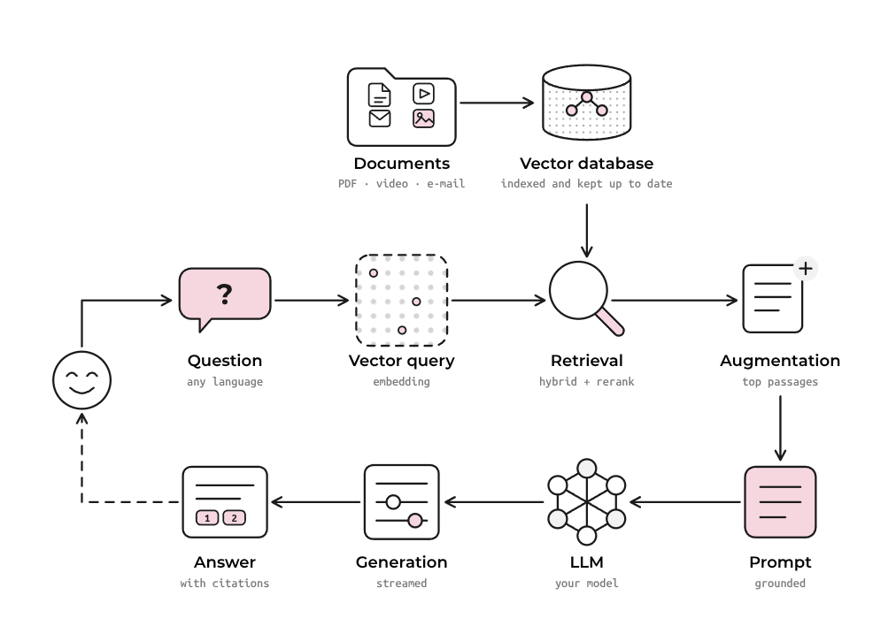

# 🦫 OpenRag — Sovereign, Open Source RAG



[OpenRag](https://open-rag.ai/) is a modular, production-grade Retrieval-Augmented Generation (RAG) framework. It runs entirely on your own infrastructure, with every parser, chunking strategy and retrieval method configurable — 100% open source, no black boxes, no lock-in.

> Built by Linagora, OpenRag is a sovereign-by-design alternative to mainstream RAG stacks.
> It is the RAG engine behind [Twake.ai](https://twake.ai).

## Table of Contents
- [🦫 OpenRag — Sovereign, Open Source RAG](#-openrag--sovereign-open-source-rag)
- [Table of Contents](#table-of-contents)
- [🎯 Goals](#-goals)
- [✨ Key Features](#-key-features)
- [🚧 Coming Soon](#-coming-soon)
- [🚀 Installation](#-installation)
  - [Prerequisites](#prerequisites)
  - [Installation and Configuration](#installation-and-configuration)
- [🔧 Troubleshooting](#-troubleshooting)
- [🤝 Support and Contributing](#-support-and-contributions)
- [📜 License](#-license)


## 🎯 Goals
- Run state-of-the-art RAG in production, on infrastructure you control
- Keep every component swappable — parsers, chunkers, retrievers, models
- Make answers verifiable, with citations back to the source document and page
- Build in the open, with the community

## ✨ Key Features
### 📁 Rich File Format Support
[OpenRag](https://open-rag.ai/) supports a comprehensive range of file formats for seamless document ingestion:

* **Text Files**: `txt`, `md`
* **Document Files**: `pdf`, `docx`, `doc`, `pptx` - Advanced PDF parsing with OCR support and Office document processing
* **E-mail**: `eml` - Message body and headers, with attachments parsed through their own format's pipeline
* **Audio Files**: `wav`, `mp3`, `flac`, `ogg`, `aac`, `wma` - Audio transcription and content extraction
* **Video Files**: `mp4`, `flv` - Speech transcription from the audio track
* **Images**: `png`, `jpeg`, `jpg`, `svg` - Vision Language Model (VLM)-powered image captioning and analysis

All files are converted to **Markdown format** for consistent processing across document types. When image captioning is enabled, any image the parser can extract is replaced with an AI-generated description.

### 🎛️ Native Web-Based Admin UI
Manage OpenRAG through the bundled web interface.

<details>

<summary>Admin UI Features</summary>

* **Drag-and-drop file upload** with batch processing capabilities
* **Real-time indexing progress** monitoring and status updates
* **Admin dashboard** to monitor RAG components (Indexer, VectorDB, TaskStateManager, etc)
* **Partition management** - organize documents into logical collections
* **Visual document preview** and metadata inspection
* **Search and filtering** capabilities for indexed content

</details>

### 🗂️ Partition-Based Architecture
Organize your knowledge base with flexible partition management:
* **Multi-tenant support** - isolate different document collections

### 💬 Interactive Chat UI with Source Attribution
Engage with your documents through our sophisticated chat interface:

<details>

<summary>Chat UI Features</summary>

* **Chainlit-powered UI** - modern, responsive chat experience
* **Source transparency** - every response includes relevant document references
</details>


### 🔌 OpenAI API Compatibility
[OpenRag](https://open-rag.ai/) API is tailored to be compatible with the OpenAI format (see the [openai-compatibility section](docs/api_documentation.md#-openai-compatible-chat) for more details), enabling seamless integration of your deployed RAG into popular frontends and workflows such as OpenWebUI, LangChain, N8N, and more. This ensures flexibility and ease of adoption without requiring custom adapters.

<details>

<summary>Summary of features</summary>

* **Drop-in replacement** for OpenAI API endpoints
* **Compatible with popular frontends** like OpenWebUI, LangChain, N8N, and more
* **Authentication support** - secure your API with token-based auth

</details>


### ⚡ Distributed Ray Deployment
Scale your RAG pipeline across multiple machines and GPUs.
<details>

<summary>Distributed Ray Deployment</summary>

* **Horizontal scaling** - distribute processing across worker nodes
* **GPU acceleration** - optimize inference across available hardware
* **Resource management** - intelligent allocation of compute resources
* **Monitoring dashboard** - real-time cluster health and performance metrics

See the section on [distributed deployment in a ray cluster](#5-distributed-deployment-in-a-ray-cluster) for more details

</details>

### 🔍 Advanced Retrieval & Reranking
[OpenRag](https://open-rag.ai/) Leverages state-of-the-art retrieval techniques for superior accuracy.

<details>

<summary>Implemented advanced retrieval techniques</summary>

* **Hybrid search** - combines semantic similarity with BM25 keyword matching
* **Contextual retrieval** - Anthropic's technique for enhanced chunk relevance
* **Multilingual reranking** - using `Alibaba-NLP/gte-multilingual-reranker-base`

For more details, [see this file](docs/features_in_details.md)

</details>


## 🚧 Coming Soon
* **📂 Expanded Format Support**: Future updates will introduce compatibility with additional formats such as `csv`, `odt`, `html`, and other widely used open-source document types.
* **🔄 Unified Markdown Conversion**: All files will continue to be converted to markdown using a consistent chunker. Format-specific chunkers (e.g., for CSV, HTML) are planned for enhanced processing.
* **🤖 Advanced Features**: Upcoming releases will include Tool Calling, Agentic RAG, and MCP to elevate your RAG workflows.
* **Enhanced Security**: Ensures data encryption both during transit and at rest.

## 🚀 Installation

For comprehensive documentation and troubleshooting guidance, visit our [documentation site](https://linagora.github.io/openrag/).

### Prerequisites
- **Python 3.12** or higher recommended
- **Docker** and **Docker Compose**
- For GPU capable machines, ensure you have the NVIDIA Container Toolkit installed. Refer to the [NVIDIA documentation](https://docs.nvidia.com/datacenter/cloud-native/container-toolkit/install-guide.html) for installation instructions.

### Installation and Configuration
#### 1. Clone the repository:
```bash
git clone --recurse-submodules git@github.com:linagora/openrag.git

cd openrag
git checkout main # or a given release
```
#### 2. Create a `.env` File
Create a `.env` file under `infra/compose/`, mirroring the structure of `infra/compose/.env.example`, to configure your environment and supply blank environment variables.

```bash
cp infra/compose/.env.example infra/compose/.env
```
#### 3. File Parser configuration 
All supported file format parsers are pre-configured. For PDF processing, **[PyMuPDFLoader](https://pymupdf.readthedocs.io/)** is the default parser — a lightweight, fast, CPU-friendly engine well suited to searchable PDFs and quick local testing.

> ⚠️ **Important**: `PyMuPDFLoader` cannot process non-searchable (image-based / scanned) PDFs and does not run OCR or extract embedded images.

<details>
<summary>For more PDF options</summary>

For OCR-scanned documents, complex layouts, tables, or embedded images, switch to **[`MarkerLoader`](https://github.com/datalab-to/marker)** (heavier; runs on GPU and CPU) by setting the **`PDFLOADER`** variable: `PDFLOADER=MarkerLoader`. Other options: `DoclingLoader`, `DotsOCRLoader`.
</details>

#### 4.Deployment: Launch the app
>[!IMPORTANT]
> The **admin UI** (a web interface for intuitive document ingestion, indexing, and management) ships bundled as the `admin-ui` service — no separate setup is required. Once the stack is up it is served at `http://localhost:ADMIN_UI_PORT/app/` (default port `8081`).

The full stack and its service configs live under **`infra/compose/`**. Place the **`.env`** you created there and run the commands from that directory (`cd infra/compose`):

```bash
# GPU deployment (recommended for optimal performance)
docker compose up -d
# docker compose down # to stop the application

# CPU deployment
docker compose --profile cpu up -d
# docker compose --profile cpu down # to stop the application
```

>[!NOTE]
> For development builds, add the **`--build`** flag to rebuild images from your working tree, e.g. `docker compose up --build -d`.

>[!WARNING]
> The first startup may take longer as required dependencies are installed. 

>[!IMPORTANT]
> For CPU-only deployments, consider these performance optimizations:
> 1. Disable the reranker by setting **`RERANKER_ENABLED=false`** (reranking is computationally intensive on CPU)
> 2. If keeping the reranker enabled (recommended for better RAG accuracy), reduce the number of documents sent for reranking by lowering **`RETRIEVER_TOP_K`** to approximately 10


Once the app is up and running, visit `http://localhost:APP_PORT` or `http:X.X.X.X:APP_PORT` to access via:

1. **`/docs`** – FastAPI’s full API documentation. See this [detailed overview of our api](docs/api_documentation.md) for more details on the endpoints.


2. **`/chainlit`** – [Chainlit chat UI](https://docs.chainlit.io/get-started/overview) to chat with your partitions. To disable it (e.g., for backend-only use), set `WITH_CHAINLIT_UI=False`.

>[!NOTE]
> Chainlit UI has no authentication by default. To enable it, follow the [dedicated guide](./docs/setup_chainlit_ui_auth.md). The same goes for chat data persistancy, enable it with this [guide](docs/chainlit_data_persistency.md)

#### Authentication Modes

OpenRag supports two authentication modes:

- **Token Mode** (`AUTH_MODE=token`, default): Bearer token authentication via `Authorization: Bearer <AUTH_TOKEN>` header. Suitable for development and programmatic access.
- **OIDC Mode** (`AUTH_MODE=oidc`): OpenID Connect flow with an external identity provider (Keycloak, LemonLDAP::NG, etc.). Users authenticate via browser redirect to the IdP.

To enable OIDC, set `AUTH_MODE=oidc` and configure the required OIDC variables (see [`infra/compose/.env.example`](./infra/compose/.env.example) for the full list).

For comprehensive OIDC setup and configuration, see the [OIDC Authentication Guide](./docs/content/docs/documentation/oidc.md) (or the [SSO Quick Start](./docs/content/docs/documentation/sso-quickstart.md) for a faster path).

3. `http://localhost:ADMIN_UI_PORT/app/` (default `8081`) to access the admin UI for easy document ingestion, indexing, and management

#### 5. Distributed deployment in a Ray cluster

To scale **OpenRag** in a distributed environment using **Ray**, follow the dedicated guide:
➡ [Deploy OpenRag in a Ray cluster](docs/content/docs/documentation/deploy_ray_cluster.md)

## Tests

To run all unit tests:

```bash
uv run pytest
```

## Documentation

For comprehensive documentation and troubleshooting guidance, visit our documentation site.

To run the documentation site locally for development:
```bash
npm i     # Install dependencies
npm run dev   # Start the development server
```

And then go to http://localhost:4321/openrag


## 🔧 Troubleshooting
<details>
<summary>Troubleshooting</summary>

### Error on dependencies installation

After running `uv sync`, if you have this error:

```
error: Distribution `ray==2.43.0 @ registry+https://pypi.org/simple` can't be installed because it doesn't have a source distribution or wheel for the current platform

hint: You're using CPython 3.13 (`cp313`), but `ray` (v2.43.0) only has wheels with the following Python ABI tag: `cp312`
```

This means your uv installation relies on cpython 3.13 while you are using python 3.12.

To solve it, please run:
```bash
uv venv --python=3.12
uv sync
```
### Error with models' weights downloading
While executing OpenRag, if you encounter a problem that prevents you from downloading the models' weights locally, then you just need to create the needed folder and authorize it to be written and executed

```bash
sudo mkdir /app/model_weights
sudo chmod 775 /app/model_weights
```
</details>


## 🤝 Support and Contributions
We ❤️ your contributions!

We encourage you to contribute to OpenRag! Here's how you can get involved:
1. Fork this repository.
2. Create a new branch for your feature or fix.
3. Submit a pull request for review.

Feel free to ask **`questions`, `suggest features`, or `report bugs` via the GitHub Issues page**. Your feedback helps us improve!


## 📜 License

OpenRag is licensed under the [AGPL-3.0](LICENSE). You are free to use, modify, and distribute this software in compliance with the terms of the license.

For more details, refer to the [LICENSE](LICENSE) file in the repository.
