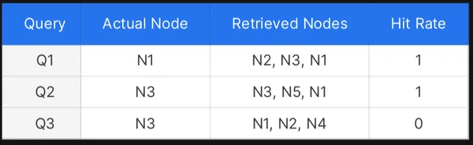
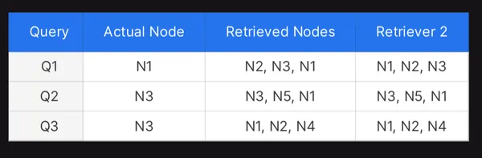
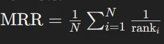
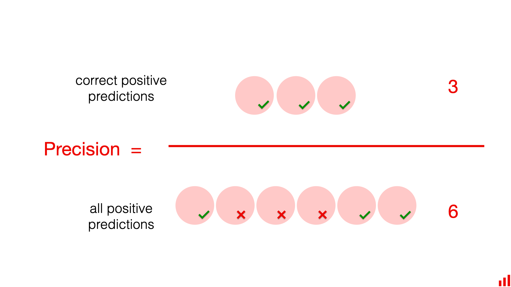
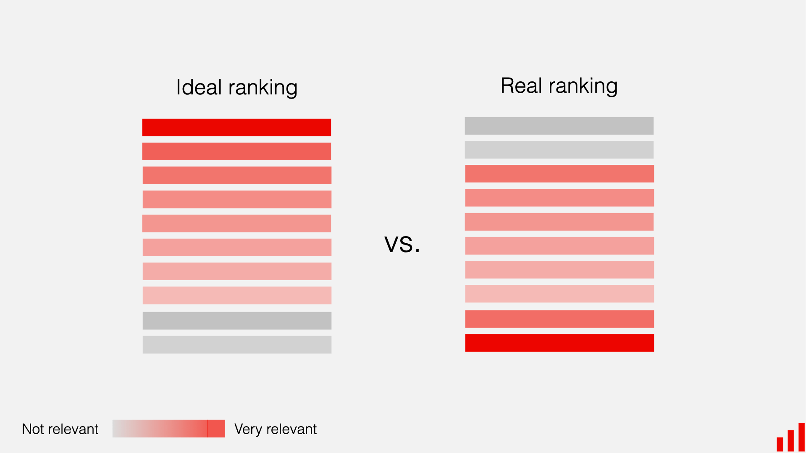
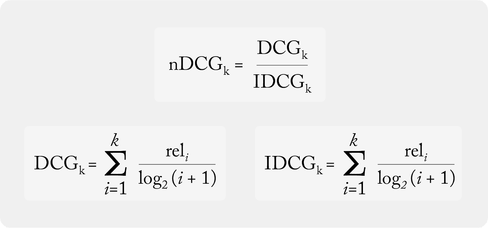

# Automatic Evaluation Pipeline

End-to-end harness for measuring an OpenRAG deployment on retrieval **and** generation quality, with a Streamlit dashboard for browsing runs and trends.

The pipeline runs in two modes:

- **Self-bootstrapping** — upload your own PDFs to OpenRAG, cluster the resulting chunks, and ask an LLM to write a synthetic Q/A dataset against them. Then benchmark.
- **Golden dataset** — bring your own curated `dataset.json` and skip straight to benchmarking. Assumes the documents are already indexed in the target partition.

---

## Layout

```
automatic-evaluation-pipeline/
├── upload_files.py        # Index pdf_files/ into OpenRAG; (optionally) trigger SCORE analysis
├── generate_questions.py  # Cluster chunks, generate Q/A pairs (+ optional unanswerable adversarial Qs)
├── benchmark.py           # Run the question set through OpenRAG and score every metric
├── context_ablation.py    # Side-by-side: with-context (RAG) vs without-context (closed-book)
├── dashboard.py           # Streamlit UI: browse past runs, compare two runs, trigger new ones
├── config.py              # Central tunable defaults (the CONFIG object) shared by all scripts
├── evaluation_prompts.py  # All judge / generator system prompts (FR + EN variants)
├── judge_schemas.py       # Pydantic schemas for structured judge output
├── metrics.py             # ROUGE / BLEU / METEOR + hit@k / MRR / nDCG / MAP / R-precision / recall@k
├── run_all.sh             # Convenience script: upload + generate + benchmark, or benchmark a golden set
├── dataset.json           # Generated or hand-curated Q/A dataset (gitignored)
├── pdf_files/             # Source documents to index (gitignored)
├── golden_uploads/        # Goldens uploaded via the dashboard (gitignored)
├── reports/               # Per-run JSON / CSV / TXT artifacts (gitignored)
└── assets/                # Metric-explanation diagrams used in this README
```

---

## Setup

### Dependencies

The module shares the parent project's virtualenv. Beyond the parent project, you need:

```
httpx loguru python-dotenv tqdm openai langchain-openai pydantic
pandas numpy scikit-learn
umap-learn hdbscan
nltk rouge-score
streamlit
pypdf python-docx python-pptx
```

(NLTK corpora `punkt`, `punkt_tab`, `wordnet`, `omw-1.4` are auto-downloaded on first use by `metrics.py`.)

### `.env`

`generate_questions.py`, `benchmark.py`, and `context_ablation.py` read these from `.env`:

| Var | Purpose |
|-----|---------|
| `BASE_URL` | Base URL of the **judge / generator** LLM (OpenAI-compatible endpoint) |
| `API_KEY` | API key for that endpoint |
| `MODEL` | Model name on that endpoint |
| `AUTH_TOKEN` | Bearer token for OpenRAG (used for chunk-fetch in faithfulness scoring; defaults to `sk-1234`) |
| `SCORE_BASE_URL` | (optional) Base URL of the SCORE corpus-analysis API |
| `SCORE_TOKEN` | (optional) Bearer token for SCORE |
| `GOLDEN_DATASET` | (optional) Path to a golden dataset, picked up by `run_all.sh` and as the fallback for `benchmark.py --dataset` |

Everything else — partition, paths, sampling params, concurrency, timeouts — lives in `config.py` (see below). The OpenRAG endpoint is passed via CLI flags. Only URLs, API keys, and tokens come from `.env`.

### Configuration (`config.py`)

All tunable behaviour lives in `config.py` as a single `CONFIG` object built from nested dataclasses. Edit the defaults there — URLs, API keys, and tokens stay in `.env`.

| Section | Used by | Key knobs |
|---------|---------|-----------|
| `common` | all scripts | `partition`, `dataset_path`, `output_dir` |
| `benchmark` | `benchmark.py` | target/judge sampling, concurrency, `label_language`, `cot_audit_fraction`, `faithfulness_fraction`, `limit` |
| `ablation` | `context_ablation.py` | `temperature`, `timeout`, `limit`, concurrency, `csv_name` |
| `question_gen` | `generate_questions.py` | gen sampling, question mix, `language` (en/fr), `clustering` (method + UMAP / KMeans / DBSCAN params) |
| `upload` | `upload_files.py` | `dir_path`, retries, timeouts, SCORE poll interval / timeout |

Every script accepts `--partition` to override `common.partition` for a single run. `benchmark.py` and `context_ablation.py` additionally take `--base-url`, `--dataset`, `--output-dir`, and `--limit`.

---

## Workflow

### 1. Index documents

Drop PDFs / DOCX / PPTX / TXT / MD into `pdf_files/` and run:

```bash
python upload_files.py [--partition *your_partition*]
```

This uploads each file under a content-hash file id (so re-runs are idempotent) and, if a `SCORE_TOKEN` is set, also kicks off an asynchronous SCORE analysis + audit and writes the latest available corpus score to `reports/score.csv`.

> The partition defaults to `common.partition` in `config.py` and can be overridden with `--partition`. The source directory (`upload.dir_path`) is also in `config.py`; the OpenRAG base URL comes from the `API_BASE_URL` env var.

### 2. Generate a Q/A dataset

```bash
python generate_questions.py [--partition *your_partition*]
```

Pulls every chunk from the chosen partition via `/partition/{p}/chunks`, reduces the embeddings with UMAP, clusters with HDBSCAN (KMeans / DBSCAN also available — set `question_gen.clustering.method` in `config.py`), then samples chunks per cluster and asks the LLM to produce:

- a **question** answerable from those chunks, plus a reference **answer**, **or**
- an **unanswerable** topic-adjacent question (no chunks attached, ground-truth answer is a refusal string) — used to measure abstention vs. hallucination.

Per-cluster volume (`n_questions_per_cluster`, `n_unanswerable_per_cluster`), the sampled-chunk range (`n_min` / `n_max`), and the question language (`language`, `en` / `fr`) are all under `question_gen` in `config.py`. Output: `dataset.json`.

### 3. Benchmark

```bash
python benchmark.py \
    --partition *your_partition* \
    --base-url http://your-openrag-host:8095 \
    --dataset ./dataset.json \
    --output-dir ./reports \
    [--limit 50]
```

For each question, the benchmark:

1. Calls OpenRAG's `/v1/chat/completions` and captures the answer, the retrieved chunk ids, per-token logprobs, and end-to-end latency.
2. Computes **retrieval** metrics against the dataset's ground-truth chunk ids (when present): hit@5, MRR, precision@k, recall@k, nDCG@k, MAP, R-precision.
3. Computes **generation** overlap metrics against the reference answer: ROUGE-1/2/L, BLEU-4, METEOR.
4. Runs the **LLM-as-judge** suite (concurrently, with shared semaphores):
   - **Completion** (1–10): how much of the reference answer is covered.
   - **Precision** (1–10): how factually aligned the response is.
   - **Refusal** verdict on every answerable row (false-refusal rate) and on every unanswerable row (abstention rate).
   - **Faithfulness** (claim-level support against the actually-retrieved chunks). Sampled — `benchmark.faithfulness_fraction` in `config.py` (default 50 %).
   - **Response label** (`Fully Correct` / `Incomplete` / `Contradictory`) per row — `benchmark.label_language` (`config.py`) controls FR vs EN judge prompt.
   - **CoT audit** — a chain-of-thought re-judging of a random sample (`benchmark.cot_audit_fraction`, default 10 %) to spot-check the cheap judges.
5. Cross-tabs the label judge vs. the score judges, and correlates per-row perplexity against both scores (Pearson + Spearman) — a sanity check that confident answers actually score higher.

Output (per run, timestamped in `reports/`): a JSON summary the dashboard reads, a TXT digest, and per-question CSVs (per-row scores, response labels with reasoning, CoT audit details).

### 4. Bring-your-own (golden) dataset

If you already have a curated dataset and the matching documents are already indexed in the partition, skip steps 1–2:

```bash
./run_all.sh --golden /path/to/my_golden.json -- --partition *your_partition*
# or equivalently
GOLDEN_DATASET=/path/to/my_golden.json ./run_all.sh -- --partition *your_partition*
```

`run_all.sh` forwards extra args after `--` straight to `benchmark.py`.

### 5. Context-contribution ablation

Quick eyeball test for whether retrieval is actually helping:

```bash
python context_ablation.py --partition *your_partition* --limit 10
```

For N random answerable questions, captures both the OpenRAG answer (with retrieved chunks) and the same generator model answering the bare question (no chunks). Writes `reports/context_ablation.csv` for side-by-side inspection in the dashboard.

### 6. Dashboard

```bash
streamlit run dashboard.py
```

- Browse every past run in `reports/`.
- Compare any two runs metric-by-metric (with deltas).
- Plot trends across all runs, grouped by metric family.
- Trigger a fresh benchmark from the sidebar (with optional golden upload, partition / URL / limit overrides) — runs as a background subprocess with a tail-log panel.
- View the latest SCORE corpus-quality result and the latest context-ablation CSV.

---

## Dataset format

`dataset.json` is a JSON list. Each entry:

```jsonc
{
    "question": "...",           // required, non-empty string
    "llm_answer": "...",         // required, the reference / ground-truth answer
    "answerable": true,          // optional, default true; set false for adversarial rows
    "chunks": [                  // optional; required for retrieval metrics
        { "id": 458974149490248568, "text": "...", "file_id": "note.pdf" }
    ]
}
```

- Rows without `chunks` still get scored on generation overlap + judges; retrieval metrics are simply skipped for them.
- Rows with `answerable: false` only get scored on the refusal judge (abstention rate). Their `chunks` field should be empty and `llm_answer` should be a refusal-style string.

`benchmark._load_and_validate_dataset` validates every entry at startup and refuses to run on a malformed file.

---

## Metrics

### Retrieval

#### Hit Rate

The percentage of times **any** correct chunk appears among the chunks retrieved.




> Hit Rate ignores the **position** of the relevant chunk. Two retrievers can have identical hit rates while one ranks the gold chunk at position 1 and the other at position 10 — clearly the first is preferable. MRR addresses this.



#### MRR — Mean Reciprocal Rank

The average reciprocal rank of the **first** correct result.

- MRR close to 1 → the right answer is usually at the top.
- MRR close to 0 → it's missing or buried deep.



#### Recall (and Recall@k)

Of all the chunks that *should* have been retrieved for the question, what fraction actually were.



#### Precision@k, MAP, R-precision

- **Precision@k** — of the top-k retrieved, how many are relevant.
- **MAP** (Mean Average Precision) — average precision across recall levels, then averaged across questions.
- **R-precision** — precision at rank R, where R = number of gold chunks.

#### nDCG — Normalized Discounted Cumulative Gain

The dominant ranking-quality metric in the literature: rewards both **retrieving** the right chunks **and** ranking them near the top.




The pipeline reports `nDCG@5`, `nDCG@10`, and a full-list `nDCG` broken down by ground-truth chunk count.

### Generation (n-gram overlap vs reference)

ROUGE-1, ROUGE-2, ROUGE-L (F1), BLEU-4 (with smoothing), and METEOR. Useful as a cheap regression signal — not as an absolute quality score (a good answer that rewords the reference can score low).

### LLM-as-judge

| Judge | Output | Notes |
|-------|--------|-------|
| **Completion** | int 1–10 | Coverage of key points from `llm_answer`. |
| **Precision** | int 1–10 | Factual alignment with `llm_answer`. |
| **CoT Completion / Precision** | reasoning + int 1–10 | Slower; sampled at `benchmark.cot_audit_fraction` to spot-check the cheap judges. |
| **Faithfulness** | per-claim verdicts | Decomposes the answer into ≤6 atomic claims and marks each `supported` / `unsupported` against the actually-retrieved chunks. Sampled at `benchmark.faithfulness_fraction`. |
| **Refusal** | `refusal` / `non_refusal` | Run on every row. Yields **false-refusal rate** on answerable rows and **abstention rate** on unanswerable rows. |
| **Label** | `Fully Correct` / `Incomplete` / `Contradictory` | A coarse, telegraphic classification per row, with one-line reasoning. |

All judges use structured output (Pydantic schemas in `judge_schemas.py`) and share an `asyncio.Semaphore` to bound concurrency. Judges occasionally emit malformed JSON; `_ainvoke_with_retry` retries up to `benchmark.judge.retry_attempts` times (default 3) before giving up on a row.

### Confidence / calibration

- **Mean per-token logprob** and **perplexity** (computed from the per-token logprobs OpenRAG forwards from the generator).
- A `Label × score-bucket` cross-tab — loud disagreements (e.g. label = `Contradictory` but completion ≥ 7) are flagged.
- Pearson and Spearman correlation of perplexity vs both completion and precision (expect negative — confident answers should score higher).

### Latency

Mean, p50, p95, p99 end-to-end seconds per OpenRAG request.

---

## Per-run artifacts

Each `python benchmark.py` writes to `--output-dir` (default `./reports/`):

| File | Contents |
|------|----------|
| `eval_<ts>.json` | Full structured summary — what the dashboard reads. |
| `eval_<ts>.txt` | Human-readable digest of every metric block. |
| `eval_<ts>.csv` | Per-question scores (completion, precision, nDCG, n_chunks, mean_logprob, perplexity). |
| `response_labels_<ts>.csv` | Per-question label + label reasoning + cheap judge scores. |
| `cot_audit_<ts>.csv` | The CoT sample — both cheap and CoT scores side by side, with reasoning. |

`upload_files.py` additionally writes `reports/score.csv` (latest SCORE corpus score + queued job ids). `context_ablation.py` writes `reports/context_ablation.csv`.
